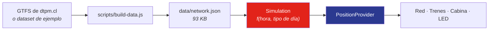

[English](README.md) · **Español**

<div align="center">


# metrovivo

**La red del Metro de Santiago en 3D y 2D — cada tren moviéndose en sincronía con el horario oficial.**

[](https://github.com/nsalloums/metrovivo-santiago/actions/workflows/deploy.yml)
[](LICENSE)
[](https://threejs.org)
[](https://nsalloums.github.io/metrovivo-santiago/)

### [→ Abrir la demo](https://nsalloums.github.io/metrovivo-santiago/)

</div>

---

Siete líneas, 126 estaciones, ~150 trenes en punta de la mañana. La posición de cada
tren es una **función determinista de la hora actual en `America/Santiago`** — derivada
de las frecuencias publicadas y de un perfil de velocidad físico, no de una animación
al azar. Haz click en cualquier tren y la cámara vuela hasta su cabina.

Sin tiles de mapa, sin servicios externos, sin backend. Un solo renderer de three.js
dibuja todo.

> [!NOTE]
> **Son posiciones simuladas, no reales.** Metro de Santiago no publica posiciones de
> vehículos en vivo, así que metrovivo calcula dónde *debería* estar cada tren según el
> horario. Ver [Por qué no hay datos en vivo](#por-qué-no-hay-datos-en-vivo) — es la
> restricción más interesante del proyecto.

## Partir rápido

```bash
npm install
npm run dev
```

Y abres la URL que imprime Vite. Eso es todo: sin API keys, sin `.env`, sin servicios
que levantar.

```bash
npm test      # 54 tests unitarios (Vitest)
npm run build
npm run smoke # 17 checks headless contra el build real (Playwright)
```

## Qué se puede hacer

| | |
|---|---|
|  | **Ir en la cabina.** Haces click en un tren y la cámara se acopla a su parabrisas. El túnel es procedural — anillos, luces de pared y durmientes pasan a un ritmo acorde a la velocidad simulada. El HUD muestra la próxima estación, cuenta regresiva y la velocidad del perfil físico. |
|  | **Transformar geografía en el plano oficial.** Cada estación guarda dos posiciones: sus coordenadas reales y una esquemática a 0/45/90°. El cambio es un lerp vértice a vértice, así que las estaciones nunca se deslizan. |
|  | **Leer la pantalla de andén.** Un panel punto-matriz ámbar lista las próximas llegadas de cualquier estación, derivadas del mismo calendario de salidas que mueve a los trenes — por eso siempre coincide con lo que ves. |
|  | **Romper la red a propósito.** `?estado=l1-suspendida` suspende una línea: no salen trenes nuevos, los que van en viaje frenan en su próxima estación y la línea se pinta gris. Otros escenarios cierran una estación o un tramo entero. |

Parámetros de depuración: `?t=08:30` fija la hora, `?day=wd\|sa\|su` fuerza el tipo de
día, `?estado=<escenario>` inyecta una contingencia. Tecla <kbd>D</kbd> (o triple-tap)
para el overlay de debug.

## Cómo funciona



`Simulation` es una función pura — sin DOM, sin renderer — y por eso todo el motor es
testeable unitariamente. `PositionProvider` es la costura: todo lo que está aguas abajo
consume ese contrato y no sabe de dónde vienen las posiciones.

<details>
<summary><b>La física: por qué los trenes aceleran en vez de hacer easing</b></summary>

<br>

Cada tramo entre estaciones usa un **perfil de velocidad trapezoidal** — acelerar a
~1 m/s², crucero, frenar — resuelto en forma cerrada para que el tren cubra exactamente
*D* metros en los *T* segundos que le da el horario. El crucero tiene clamp a 80 km/h;
si se activa, se recalcula la aceleración para seguir llegando puntual.

La implementación anterior usaba easing senoidal, que nunca *sostiene* una velocidad:
llega a un pico y frena de inmediato. Un metro real mantiene crucero la mayor parte del
tramo:

| Tramo L1 | Largo | Tiempo | Media | Pico senoidal | Crucero trapezoidal |
|---|---|---|---|---|---|
| República → Los Héroes | 355 m | 45 s | 28,4 km/h | 42,6 km/h | 36,7 km/h |
| Baquedano → Salvador | 931 m | 67 s | 50,0 km/h | 75,0 km/h | 70,9 km/h sostenido |
| Escuela Militar → Manquehue | 1385 m | 100 s | 50,0 km/h | 75,0 km/h | 60,1 km/h sostenido |

La media no cambia — la fija el horario. Lo que cambia es la *forma*, y eso es lo que se
siente en la cabina.

**1 unidad = 1 metro** en toda la app. La proyección local se auditó contra la distancia
haversine: 0,05 % de error en San Pablo↔Los Dominicos (16 177 m vs 16 185 m). Se
reproduce con `node scripts/audit-units.mjs`.

</details>

<details>
<summary><b>Render: un renderer, dos cámaras, cero tiles</b></summary>

<br>

- Cada línea es una cinta (triangle strip) extruida sobre una curva Catmull-Rom
  centrípeta que pasa por sus estaciones, proyectadas a un plano local en metros
  centrado en Santiago. Estaciones y trenes son `InstancedMesh`: un draw call cada uno.
- **3D**: cámara en perspectiva con órbita amortiguada, vista tipo maqueta inclinada.
- **2D**: ortográfica cenital con pan/zoom.
- **El switch** es una timeline GSAP de ~1,2 s que eleva y endereza la cámara mientras
  reduce el FOV manteniendo constante la altura visible — un dolly-zoom. La perspectiva
  converge así a la proyección ortográfica, y el intercambio de cámara al final es
  imperceptible.
- El contexto urbano (río Mapocho, grilla de calles) es geometría propia, no imágenes.
- El túnel procedural existe **solo** en la vista de cabina: anillos y luces se
  reposicionan en una ventana móvil alrededor de la cámara (object pooling).

60 fps en móvil: geometría de red estática (el buffer solo se reescribe durante el
morph), `pixelRatio` limitado a 2, materiales sin iluminación, sin postprocesado y un
loop de render sin allocations.

</details>

<details>
<summary><b>El morph geografía ↔ diagrama</b></summary>

<br>

Cada estación guarda dos posiciones: la geográfica (GTFS o dataset de ejemplo) y una
esquemática (ángulos 0/45/90°, espaciado uniforme), definida a mano en
`scripts/sample-data.mjs` con *pins* — estaciones ancladas a la grilla — y *vias* —
codos del trazado. Las estaciones sin pin se reparten uniformemente entre pins por
longitud de arco.

El preprocesador muestrea **ambos** trazados con la misma parametrización (16 muestras
por tramo entre estaciones), de modo que el morph es un lerp vértice a vértice que no
desliza las estaciones. Los trenes se re-muestrean cada frame sobre ambos trazados por
longitud de arco y se mezclan con el mismo progreso, sincronizado con la cámara.

</details>

<details>
<summary><b>Operación expresa: Ruta Roja y Ruta Verde</b></summary>

<br>

En L2, L4 y L5, de lunes a viernes en punta (06:00–09:00 y 18:00–21:00), los trenes
alternan dos patrones de parada. Cada patrón se detiene solo en sus estaciones más las
comunes, y cruza las demás a velocidad de crucero sin frenar — el perfil trapezoidal se
calcula entre *paradas del patrón*, no entre estaciones.

| Línea | Estaciones | Viaje común | Ruta Roja | Ruta Verde |
|---|---|---|---|---|
| L2 | 26 | 34,9 min | 31,9 min (17 paradas) | 31,9 min (17 paradas) |
| L4 | 23 | 35,5 min | 32,8 min (15 paradas) | 32,8 min (15 paradas) |
| L5 | 30 | 42,7 min | 39,6 min (21 paradas) | 39,9 min (22 paradas) |

Los trenes que ya iban en viaje al cerrarse la ventana completan su patrón.

> [!WARNING]
> **La clasificación de estaciones es una aproximación manual.** Si el GTFS trae
> variantes de parada, el preprocesador las deriva automáticamente — pero el feed de
> DTPM no modela Roja/Verde, así que la clasificación vive en `express-config.json`
> como una aproximación escrita a mano al esquema conocido a enero de 2026. Esto cambia
> con los años: contrastar con [metro.cl](https://www.metro.cl) antes de confiar en ella.

</details>

<details>
<summary><b>Horario y flota</b></summary>

<br>

El servicio corre 06:00–23:00 de lunes a sábado y 07:30–23:00 los domingos; fuera de
ese horario la app muestra la pantalla "Metro cerrado". Los trenes virtuales parten de
cada terminal según la frecuencia vigente y pausan ~20 s por andén.

| Línea | Estaciones | Frecuencia punta | Valle | Trenes @ 08:00 | Viaje completo |
|---|---|---|---|---|---|
| L1 | 27 | 120 s | 210 s | 32 | 31,9 min |
| L2 | 26 | 160 s | 260 s | 24 | 34,9 min |
| L3 | 21 | 180 s | 300 s | 22 | 32,4 min |
| L4 | 23 | 180 s | 300 s | 22 | 35,5 min |
| L4A | 6 | 300 s | 480 s | 6 | 11,7 min |
| L5 | 30 | 150 s | 240 s | 32 | 42,7 min |
| L6 | 10 | 240 s | 360 s | 10 | 20,3 min |

Flota en toda la red: **148 trenes a las 08:00**, 96 al mediodía, 60 a las 22:00.

</details>

<details>
<summary><b>Hacer perceptible el movimiento</b></summary>

<br>

A velocidad real, un tren a 50 km/h sobre una ciudad de 30 km es casi imperceptible.
Eso es escala, no un bug. Para que la red se sienta viva:

- **Estelas** — cada tren arrastra quads aditivos del color de su línea, que se
  desvanecen con la distancia y se apagan al detenerse.
- **Respiración** — los trenes pulsan sutilmente mientras esperan en el andén.
- **Control de tiempo** — ×1 / ×10 / ×60, slider de hora del día y un botón "● VIVO"
  que vuelve a la hora real de Santiago. En ×60 la red completa se ve circular.

Todo respeta `prefers-reduced-motion`: sin estelas, sin pulso, tweens de cámara
acortados y marquesina LED estática.

</details>

<details>
<summary><b>Decisiones de diseño</b></summary>

<br>

- **Colores de línea** aproximados a ojo contra el plano oficial: L1 `#E2231A`,
  L2 `#FFCB05`, L3 `#9A6229`, L4 `#2B3990`, L4A `#00A9E0`, L5 `#009E49`, L6 `#8F3F97`.
- **Tipografía** de señalética: [Hind](https://fonts.google.com/specimen/Hind) (sans
  humanista tipo Frutiger) más VT323 para el panel LED, con fallbacks del sistema.
- **Insignias de línea** — círculo del color con el número en blanco, como en la
  señalética real; sirven además de filtro clickeable.
- **Tooltip de estación** = placa de andén: nombre más insignias de combinación, con el
  borde del color de la línea principal.
- **Isotipo propio.** El logo oficial de Metro es marca registrada y no se usa; el rombo
  rojo es original.

</details>

## Por qué no hay datos en vivo

Una versión anterior decía mostrar el estado **real** del servicio — líneas suspendidas,
estaciones cerradas — a través de un proxy serverless. Esa funcionalidad se eliminó, y
la razón vale la pena dejarla escrita.

Existen dos fuentes. Ninguna sirve desde un sitio estático:

| Fuente | Estado | Por qué falla |
|---|---|---|
| `metro.cl/api/estadoRedDetalle.php` | **Viva y correcta** | No envía cabeceras CORS. El navegador no puede leerla; necesita un proxy server-side. |
| `api.xor.cl/red/metro-network` | **Rota en silencio** | Envía `access-control-allow-origin: *`, pero scrapea `metro.cl/tu-viaje/estado-red`, una página que hoy devuelve **404**. Responde `{"issues": false, "lines": []}` para siempre. |

La segunda es la peligrosa. Devuelve HTTP 200, JSON válido y `api_status: "OK"` mientras
informa una red vacía. Contrastado con la realidad el 2026-07-30: metro.cl reportaba L5
con *"Santa Isabel estará cerrada y sin detención de trenes"*; la API comunitaria
reportaba cero incidencias.

**Un "todo normal" silenciosamente falso es peor que no tener dato**, sobre todo para
alguien decidiendo si tomar el metro. Así que la capa en vivo se fue, en vez de quedarse
equivocada.

Lo que sí sobrevivió es la parte realmente interesante: el **motor de contingencias**.
Los escenarios de [`src/scenarios.js`](src/scenarios.js) se inyectan con
`?estado=<nombre>` y la simulación reacciona de verdad: una línea suspendida deja de
despachar y los trenes en viaje frenan en su próxima estación; un tramo cerrado parte la
línea en sub-líneas que hacen turnback en las fronteras; una estación suelta cerrada se
cruza a velocidad de crucero, reusando la física de paso directo de la ruta expresa.

**Reactivar el estado en vivo** requiere exactamente una cosa: un proxy server-side para
metro.cl (sirve cualquier runtime) y un normalizador para su esquema real, que es
`{"l1": {estado, mensaje_app, estaciones: [...]}, ...}` — un objeto indexado por línea,
no el arreglo `{lineas: [...]}` que esperaba el parser antiguo. `Simulation.applyEstado()`
ya acepta la forma normalizada, así que nada más cambiaría.

## Datos

`scripts/build-data.js` genera `data/network.json` (93 KB): curvas de línea muestreadas,
ambas posiciones por estación y frecuencias por franja horaria y tipo de día.

- **Con GTFS oficial** — descarga el feed vigente desde
  [dtpm.cl](https://www.dtpm.cl/index.php/documentos/gtfs-vigente), descomprímelo y corre
  `node scripts/build-data.js ruta/al/gtfs`. El script filtra `route_type = 1`, toma el
  viaje representativo por ruta, deriva frecuencias de `frequencies.txt` + `calendar.txt`
  y asigna el layout esquemático por nombre de estación.
- **Sin GTFS** — se usa el dataset de ejemplo incluido: las 7 líneas reales (L1–L6 y L4A,
  126 estaciones) con coordenadas aproximadas (±300 m) y frecuencias dentro de los rangos
  publicados. Es lo que corre la demo, y todavía no ha sido validado contra un feed GTFS
  de producción.

## Deploy

Cada push a `main` publica en GitHub Pages vía
[`.github/workflows/deploy.yml`](.github/workflows/deploy.yml): primero corren los tests,
después el build, después el deploy. La única configuración es **Settings → Pages →
Source: GitHub Actions**. La ruta base se deriva del nombre del repositorio
automáticamente, así que un fork se publica en su propia URL sin editar nada.

## Contribuir

Issues y pull requests son bienvenidos. Corre `npm test` y `npm run smoke` antes de abrir
uno. Lo más útil ahora mismo: validar el build contra un feed GTFS de producción, y
verificar la clasificación de Ruta Roja/Verde de `express-config.json` contra la
información actual de metro.cl.

## Licencia

El código es [MIT](LICENSE). Marcas, procedencia de los datos y atribución están en
[NOTICE.md](NOTICE.md).

metrovivo no está afiliado a Metro de Santiago ni a la DTPM. "Metro" y su logotipo son
marcas de sus respectivos titulares; este proyecto usa un isotipo propio y colores
aproximados de la señalética. Las posiciones de los trenes son simuladas y no deben
usarse para planificar un viaje.
