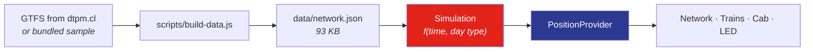

**English** · [Español](README.es.md)

<div align="center">


# metrovivo

**The Santiago de Chile Metro network in 3D and 2D — every train moving in sync with the official timetable.**

[](https://github.com/nsalloums/metrovivo-santiago/actions/workflows/deploy.yml)
[](LICENSE)
[](https://threejs.org)
[](https://nsalloums.github.io/metrovivo-santiago/)

### [→ Open the live demo](https://nsalloums.github.io/metrovivo-santiago/)

</div>

---

Seven lines, 126 stations, ~150 trains at morning rush hour. Every train's position
is a **deterministic function of the current time in `America/Santiago`** — derived
from published headways and a physical speed profile, not from random animation.
Click any train and the camera flies into its cab.

No map tiles, no external services, no backend. One three.js renderer draws the
whole thing.

> [!NOTE]
> **These are simulated positions, not real ones.** Metro de Santiago does not
> publish live vehicle positions, so metrovivo computes where each train *should*
> be according to the timetable. See [Why there is no live data for the metro](#why-there-is-no-live-data-for-the-metro)
> — it's the most interesting constraint in the project.
>
> **Buses are the exception**: those positions come from real measurements. See [Buses](#buses).

## Quick start

```bash
npm install
npm run dev
```

Then open the URL Vite prints. That's it — no API keys, no `.env`, no services to run.

```bash
npm test     # 54 unit tests (Vitest)
npm run build
npm run smoke # 17 headless checks against the real build (Playwright)
```

## What you can do

| | |
|---|---|
|  | **Ride in the cab.** Click a train and the camera docks to its front window. The tunnel is generated procedurally — rings, wall lights and sleepers stream past at a rate matched to the simulated speed. The HUD shows the next station, a live countdown and the speed from the physical profile. |
|  | **Morph geography into the official diagram.** Every station stores two positions — its real coordinates and a schematic one at 0/45/90°. The switch is a vertex-to-vertex lerp, so stations never slide. |
|  | **Read the platform display.** An amber dot-matrix panel lists the next arrivals for any station, derived from the same departure schedule that drives the trains — so it always agrees with what you see on screen. |
|  | **Break the network on purpose.** `?estado=l1-suspendida` suspends a line: no new departures, trains already en route brake at their next station, and the line goes grey. Other scenarios close a station or a whole segment. |

Debug parameters: `?t=08:30` pins the clock, `?day=wd\|sa\|su` forces the day type,
`?estado=<scenario>` injects a contingency. Press <kbd>D</kbd> (or triple-tap) for the
debug overlay.

## How it works



`Simulation` is a pure function — no DOM, no renderer — which is why the whole engine
is unit-testable. `PositionProvider` is the seam: everything downstream consumes that
contract and doesn't know where positions come from.

<details>
<summary><b>The physics: why trains accelerate instead of easing</b></summary>

<br>

Each inter-station run uses a **trapezoidal speed profile** — accelerate at ~1 m/s²,
cruise, brake — solved in closed form so the train covers exactly *D* metres in the
*T* seconds the timetable allows. Cruise speed is clamped to 80 km/h; if the clamp
engages, acceleration is recomputed so the train still arrives on time.

The earlier implementation used sinusoidal easing, which never *sustains* a speed —
it peaks and immediately brakes. Real metros hold cruise for most of a run:

| L1 segment | Length | Time | Average | Sinusoidal peak | Trapezoidal cruise |
|---|---|---|---|---|---|
| República → Los Héroes | 355 m | 45 s | 28.4 km/h | 42.6 km/h | 36.7 km/h |
| Baquedano → Salvador | 931 m | 67 s | 50.0 km/h | 75.0 km/h | 70.9 km/h sustained |
| Escuela Militar → Manquehue | 1385 m | 100 s | 50.0 km/h | 75.0 km/h | 60.1 km/h sustained |

The average doesn't change — the timetable fixes it. The *shape* does, and that's
what you feel in the cab.

**1 unit = 1 metre** throughout. The local projection was audited against the
haversine distance: 0.05 % error over San Pablo↔Los Dominicos (16 177 m vs 16 185 m).
Run `node scripts/audit-units.mjs` to reproduce.

</details>

<details>
<summary><b>Rendering: one renderer, two cameras, zero tiles</b></summary>

<br>

- Each line is a triangle strip extruded along a centripetal Catmull-Rom curve through
  its stations, projected onto a local plane in metres centred on Santiago. Stations
  and trains are `InstancedMesh` — one draw call each.
- **3D**: perspective camera with damped orbit controls, tilted like a scale model.
- **2D**: orthographic top-down with pan/zoom.
- **The switch** is a ~1.2 s GSAP timeline that raises and levels the camera while
  narrowing the FOV, keeping the visible height constant — a dolly-zoom. The
  perspective projection converges on the orthographic one, so swapping cameras at
  the end is imperceptible.
- The city context (Mapocho river, street grid) is generated geometry, not imagery.
- The procedural tunnel exists **only** in cab view: rings and wall lights are pooled
  and repositioned in a moving window around the camera.

60 fps on mobile: static network geometry (the buffer is only rewritten during the
morph), `pixelRatio` capped at 2, unlit materials, no post-processing, and an
allocation-free render loop.

</details>

<details>
<summary><b>The geography ↔ diagram morph</b></summary>

<br>

Every station carries two positions: geographic (from GTFS or the bundled dataset)
and schematic (0/45/90° angles, uniform spacing, defined by hand in
`scripts/sample-data.mjs` with *pins* — stations anchored to the grid — and *vias* —
bends in the route). Stations without a pin are distributed uniformly between pins by
arc length.

The preprocessor samples **both** paths with the same parameterisation (16 samples per
inter-station segment), so the morph is a vertex-to-vertex lerp that never slides
stations. Trains are re-sampled every frame along both paths by arc length and blended
with the same progress, synchronised with the camera.

</details>

<details>
<summary><b>Express operation: Ruta Roja and Ruta Verde</b></summary>

<br>

On L2, L4 and L5, weekdays during peak hours (06:00–09:00 and 18:00–21:00), trains
alternate between two stopping patterns. Each pattern serves only its own stations
plus the shared ones, and crosses the rest at cruise speed without braking — the
trapezoidal profile is computed between *stops of the pattern*, not between stations.

| Line | Stations | Common trip | Ruta Roja | Ruta Verde |
|---|---|---|---|---|
| L2 | 26 | 34.9 min | 31.9 min (17 stops) | 31.9 min (17 stops) |
| L4 | 23 | 35.5 min | 32.8 min (15 stops) | 32.8 min (15 stops) |
| L5 | 30 | 42.7 min | 39.6 min (21 stops) | 39.9 min (22 stops) |

Trains already running when the window closes complete their pattern.

> [!WARNING]
> **The station classification is a manual approximation.** If the GTFS feed contains
> stopping variants, the preprocessor derives them automatically — but DTPM's feed does
> not model Roja/Verde, so the classification lives in `express-config.json` as a
> hand-written approximation to the scheme known as of January 2026. These change over
> the years. Verify against [metro.cl](https://www.metro.cl) before relying on them.

</details>

<details>
<summary><b>Timetable and fleet</b></summary>

<br>

Service runs 06:00–23:00 on weekdays and Saturdays, 07:30–23:00 on Sundays; outside
those hours the app shows a "Metro cerrado" screen. Virtual trains depart each terminal
according to the headway in force and dwell ~20 s per platform.

| Line | Stations | Peak headway | Off-peak | Trains @ 08:00 | Round trip |
|---|---|---|---|---|---|
| L1 | 27 | 120 s | 210 s | 32 | 31.9 min |
| L2 | 26 | 160 s | 260 s | 24 | 34.9 min |
| L3 | 21 | 180 s | 300 s | 22 | 32.4 min |
| L4 | 23 | 180 s | 300 s | 22 | 35.5 min |
| L4A | 6 | 300 s | 480 s | 6 | 11.7 min |
| L5 | 30 | 150 s | 240 s | 32 | 42.7 min |
| L6 | 10 | 240 s | 360 s | 10 | 20.3 min |

Fleet across the network: **148 trains at 08:00**, 96 at midday, 60 at 22:00.

</details>

<details>
<summary><b>Making motion perceptible</b></summary>

<br>

At real speed a train doing 50 km/h across a 30 km city is nearly imperceptible.
That's scale, not a bug. To make the network feel alive:

- **Trails** — each train drags additive quads in its line colour, fading with
  distance and extinguishing when it stops.
- **Breathing** — trains pulse subtly while dwelling at a platform.
- **Time controls** — ×1 / ×10 / ×60, a time-of-day slider, and a "● VIVO" button
  that returns to real Santiago time. At ×60 the whole network circulates visibly.

All of it respects `prefers-reduced-motion`: no trails, no pulse, shortened camera
tweens, static LED marquee.

</details>

<details>
<summary><b>Design decisions</b></summary>

<br>

- **Line colours** approximated by eye against the official map: L1 `#E2231A`,
  L2 `#FFCB05`, L3 `#9A6229`, L4 `#2B3990`, L4A `#00A9E0`, L5 `#009E49`, L6 `#8F3F97`.
- **Typography** from transit signage: [Hind](https://fonts.google.com/specimen/Hind)
  (humanist sans, Frutiger-like) plus VT323 for the LED panel, with system fallbacks.
- **Line badges** — coloured circle, white number, as on real signage; they double as
  clickable filters.
- **Station tooltip** = platform nameplate: name plus interchange badges, bordered in
  the primary line's colour.
- **Own logo mark.** Metro's official logo is a registered trademark and is not used;
  the red diamond is original.

</details>

## Why there is no live data for the metro

> [!TIP]
> This section is about **trains**. Buses are a different story — RED does publish
> live bus arrivals, and metrovivo shows them. See [Buses](#buses).

An earlier version claimed to show the **real** service status — suspended lines,
closed stations — fetched through a serverless proxy. That feature has been removed,
and the reason is worth writing down.

Two sources exist. Neither works from a static site:

| Source | Status | Why it fails |
|---|---|---|
| `metro.cl/api/estadoRedDetalle.php` | **Live and accurate** | Sends no CORS headers. A browser cannot read it; it needs a server-side proxy. |
| `api.xor.cl/red/metro-network` | **Silently broken** | Sends `access-control-allow-origin: *`, but it scrapes `metro.cl/tu-viaje/estado-red` — a page that now returns **404**. It answers `{"issues": false, "lines": []}` forever. |

The second one is the dangerous one. It returns HTTP 200, valid JSON and
`api_status: "OK"` while reporting an empty network. Checked against reality on
2026-07-30: metro.cl reported L5 with *"Santa Isabel estará cerrada y sin detención de
trenes"*; the community API reported no issues at all.

**A silently false "everything is normal" is worse than no data**, especially for
someone deciding whether to take the metro. So the live layer is gone rather than
wrong.

What survived is the part that was actually interesting — the **contingency engine**.
The scenarios in [`src/scenarios.js`](src/scenarios.js) are injected with
`?estado=<name>` and the simulation genuinely reacts: suspended lines stop dispatching
and running trains brake at their next station; a closed segment splits the line into
sub-lines that turn back at the boundaries; a single closed station gets crossed at
cruise speed, reusing the express pass-through physics.

**Re-enabling live status** needs exactly one thing: a server-side proxy for metro.cl
(any runtime works) and a normaliser for its actual schema, which is
`{"l1": {estado, mensaje_app, estaciones: [...]}, ...}` — an object keyed by line, not
the `{lineas: [...]}` array shape the old parser expected. `Simulation.applyEstado()`
already accepts the normalised form, so nothing else would change.

## Buses

Press **BUSES** and the city switches layers: the metro's ribbons disappear (station
dots stay as urban reference), and the **entire RED fleet** appears over the official
route network. Two sources, one toggle:

- **ITINERARIO** (default) — ~3,500 amber buses in **continuous motion**, each one a
  deterministic function of the official time: departures from `frequencies.txt`
  headway windows, position interpolated between the per-stop passing times of
  `stop_times.txt`. The speed profile between stops comes from the timetable itself —
  the median simulated bus moves at ~18 km/h, the real commercial speed. This is the
  same epistemic class as metrovivo's trains: where each bus *should* be.
- **GPS** — ~4,200 cyan buses as **measured positions**, one ~100 KB request per
  minute. Each bus carries its own measurement timestamp and that age is drawn, not
  hidden: fresh glows cyan, five-minutes-old fades to grey. Nothing is animated between
  measurements — an honest jump is worth more than an invented glide.

The two strata never share a colour: **amber = simulated, cyan = measured**, and the
info card on any clicked bus says which one it is (simulated buses have no plate —
there is no vehicle).

**Click a simulated bus and you ride it**, the same one-click gesture that puts you in
a train cab. The maquette (34 m bus markers, route network floating overhead) switches
off and a street is built at real scale: roadway, kerbs, a dashed centre line every
12 m and street lights every 30 m — at RED's real commercial speed of ~19 km/h that
optical flow is what makes the speed legible. Every stop of the route carries its
**official GTFS name** on a sign, and the HUD counts down to the next one. The destination
comes from the trip's own **headsign** (`trip_headsign`) — the bus reads “to Peñalolen”,
what it actually displays, not “Avenida Lo Blanco / esq. J. Edwards Bello”, which is
merely the corner where it stops. The feed's 112 circular routes are marked as such. Other buses
pass at true size (12 m). Riding is offered only on the ITINERARIO stratum: a
GPS-measured bus is a ~33 s old photograph, and travelling inside one would mean
inventing the motion between fixes — exactly what the rest of the project refuses to
do. Escape, or the exit button, flies you back to the orbit.

Click any stop and you get **real arrivals**: plate, metres away and arrival window,
straight from RED. Pick one bus and it appears on its official route, and metrovivo
follows it — when it stops being visible from that stop, it asks the *next stop on the
route* about the same plate, and the trip continues. Every leg is confirmed by a
measurement, not by a clock.

This is the one layer of metrovivo showing data that is **not** simulated, so it is worth
being exact about what is measured and what is inferred.

**Two sources, two regimes.**

- *Fleet* — `velocidades.seguimos.cl` serves the whole fleet's AVL (GPS position, plate,
  per-bus timestamp) with open CORS in a single ~100 KB (brotli) response. Measured:
  each bus reports roughly once a minute (73 % of timestamps renew between snapshots
  70 s apart), so metrovivo polls **once per minute**, only while the mode is on and the
  tab is visible. It is a community feed with no published terms and no guarantee of
  continuity — if it dies, the fleet mode says so and nothing else depends on it.
- *Stop arrivals* — `https://api.xor.cl/red/bus-stop/{code}` sends
  `access-control-allow-origin: *`, so a static site can read it with no proxy. It only
  answers if you already know the stop code, and publishes no listing — the catalogue
  comes from the GTFS, whose **`stop_id` *is* that code**. Measured over the whole
  catalogue: 97 % of stops answer `status_code 0`. A city-wide sweep of this API would
  be both abusive (it is one person's project) and a lie: it returns only the next ~2
  buses per stop, a *sample* that would masquerade as a fleet. That is exactly what the
  fleet feed is for.

**What `meters_distance` is.** Distance to the stop **along the route**, not as the crow
flies. Verified by tracking 67 plates for 12 minutes: every one decreases monotonically,
at 6–25 km/h — the commercial speed of an urban bus. The backend refreshes every **33 s**
(median; p90 34 s).

**What is real and what is not:**

| | |
|---|---|
| Plate, metres, arrival window | **Measured.** Comes from RED, shown as received. |
| The route drawn on the map | **Official.** DTPM geometry. Checked against real GPS positions: they fall on the attributed route with a **median of 3 m**, 72 of 73 within 60 m. Direction is resolved from the (stop, service) pair, unique in 99.5 % of cases. |
| The bus's position along that route | **Inferred, and the weakest link.** It is `arc(stop) − metres`. Against live GPS ground truth it beats the null hypothesis ("the bus is at the stop") in 85 % of cases — median 653 m of error versus 3,874 m — and it sits *ahead* of the GPS fix in 93 % of cases, which is the right sign, since the API reading is fresher than the AVL feed. But the reference itself lags by a median of 121 s, so **the position cannot be validated to better than a few hundred metres.** |

That last row is why **the bus is drawn blurrier than the simulated train** — the opposite
of the intuitive choice. The train is a clean mathematical fiction, so it gets a crisp
capsule. The bus is a dirty measurement, so it gets a smear: an uncertainty band along the
route covering how far it could have travelled since it was measured, which grows on its
own between readings and *jumps* when a new one arrives. The jump is honest. We do not
know where it went; we know where it was and where it is now.

`src/bus/placement.js` is a pure function and **abstains** rather than guessing: unknown
service (`413c` is live in the API and absent from `routes.txt`), a stop serving both
directions, a bus before the start of the variant we hold, or two stops that disagree by
more than 250 m about where it is. None of those branches is filled in "just in case" —
a plausible wrong dot is worse than no dot.

**Rate limiting is in the transport, not the callers.** `src/bus/xor-client.js` is the only
file in the project allowed to call `fetch`. api.xor.cl is one person's GPL-3.0 project and
every request of ours hits red.cl/SMSBus behind it; a static site has no shared cache, so
N visitors are N× the traffic. Token bucket, a 20 s floor per stop, a hard session cap,
a circuit breaker, and **zero requests while the tab is hidden**. Polling is on demand —
the open stop, plus one stop ahead while you follow a bus. Never a city-wide sweep, which
would also be a lie: the API returns only the next ~2 buses per stop, so that map would be
a *sample* presented as a fleet.

**Plates** appear only on the bus you explicitly follow. A plate is painted on the outside
of the bus and it is what makes the tracking *verifiable* — you can look at the bus and
check that metrovivo is not lying. But plate + position + time sustained over a period
describes the working day of a person identifiable by anyone who knows the shift, so:
never in lists, never in `localStorage`, never in the URL, and **no punctuality, speed or
driving-behaviour metrics derived from this data**. That is the use that turns it into
workplace surveillance with a dataviz skin.

The layer is gated behind `data.meta.source !== 'sample'`: metre-accurate stops on top of
approximate station coordinates would misalign in a way a visitor cannot diagnose.

## Data

Everything is generated from the **official DTPM GTFS feed**:

```bash
npm run gtfs          # discovers and downloads the current feed
npm run data .cache/gtfs/<version>       # -> data/network.json  (metro)
npm run data:bus .cache/gtfs/<version>   # -> data/bus/*.json    (buses)
```

`scripts/fetch-gtfs.mjs` scrapes `dtpm.cl/index.php/noticias/gtfs-vigente` for the
current dated `.zip`, extracts it (no npm dependencies — it reads the ZIP with `zlib`)
and records provenance in `data/.gtfs-provenance.json`. It has two guards that are not
optional, because the failure mode in this domain is not a 404 — it is a 200 with rotten
data:

1. It **rejects `dtpm.cl/descargas/gtfs/GTFS.zip`** (the undated one). That URL answers
   200 with 6 MB of perfectly well-formed GTFS whose `feed_end_date` was **20201231**.
   It is the URL still published by Mobility Database and most tutorials.
2. It **aborts if `feed_end_date` has passed**. An expired feed keeps looking valid and
   silently contains stops that no longer exist.

`data/network.json` (98 KB) holds sampled line curves, both positions per station, each
station's source `lon/lat`, and headways by time band and day type. `data/bus/` holds
the stop catalogue and route geometry — see [Buses](#buses).

<details>
<summary><b>What validating against a production feed actually changed</b></summary>

<br>

The GTFS path had never been run against a real feed. Doing it surfaced four bugs, all
of the same family — code that degraded silently instead of failing:

| | |
|---|---|
| **Headways came from the sample dataset** | Metro trips are scheduled explicitly in `stop_times.txt`; **not one of the 10,438 L1–L6 trips appears in `frequencies.txt`**. `bandsFor()` returned empty and the build fell back to the bundled sample — for the single quantity the whole project is about — while labelling itself `meta.source: "gtfs"`. Headways are now derived from actual departures. |
| **Express service was invented on L1, L3 and L6** | The old heuristic took the 2nd and 3rd longest stop patterns as Ruta Roja/Verde. A real feed has many patterns per line and most are short-turns: L1 has 6, L3 has 15, L6 has 7, and **none of them skips a single interior station**. Ruta Expresa = same terminals + skips interior stops; it now matches reality (L2, L4, L5 only). |
| **Weekday headways were halved** | Metro schedules `LJ` (Mon–Thu) and `V` (Friday) as separate calendars, both mapping to `wd`. Summing them put L1 at 1 min at peak instead of ~2. |
| **Six central stations fell out of the diagram** | The project's id vocabulary predates the feed and abbreviates (`u-de-chile` vs `universidad-de-chile`). They were being placed by interpolation. |

The sample dataset's coordinates turned out to be off by a **median of 636 m** and up to
**4.1 km** (Pudahuel) — not the ±300 m previously claimed. `tests/units.test.js` was
measuring that drift rather than the projection; it now compares against each station's
own `ll`, and the projection's real error is **0.01–0.58 %**.

</details>

## Deployment

Every push to `main` publishes to GitHub Pages via
[`.github/workflows/deploy.yml`](.github/workflows/deploy.yml) — tests run first, then
the build, then the deploy. The only setup is **Settings → Pages → Source: GitHub
Actions**. The base path is derived from the repository name automatically, so a fork
deploys to its own URL with no edits.

## Contributing

Issues and pull requests are welcome. Run `npm test` and `npm run smoke` before opening
one. The most useful contributions right now: widening the bus layer's ground-truth
validation (see [Buses](#buses) — the along-route position is the weakest link), and
verifying the Ruta Roja/Verde classification in `express-config.json`
against current metro.cl information.

## License

Code is [MIT](LICENSE). Trademarks, data provenance and attribution are covered in
[NOTICE.md](NOTICE.md).

metrovivo is not affiliated with Metro de Santiago or DTPM. "Metro" and its logo are
trademarks of their respective owners; this project uses an original logo mark and
approximated signage colours. Train positions are simulated and must not be used to
plan a trip.
