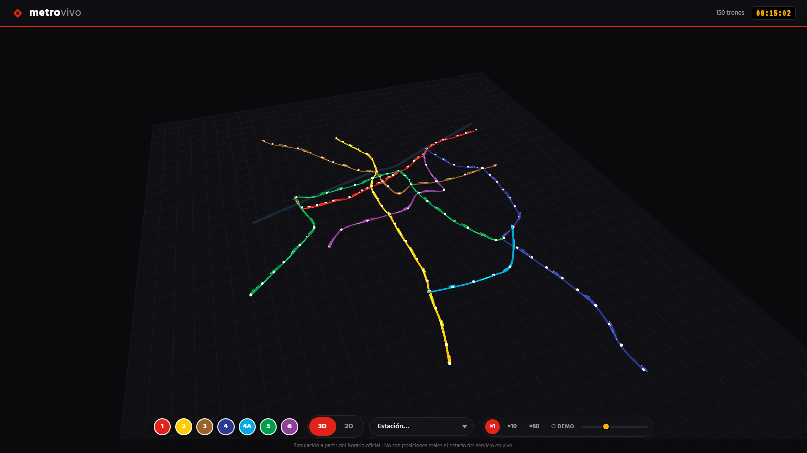
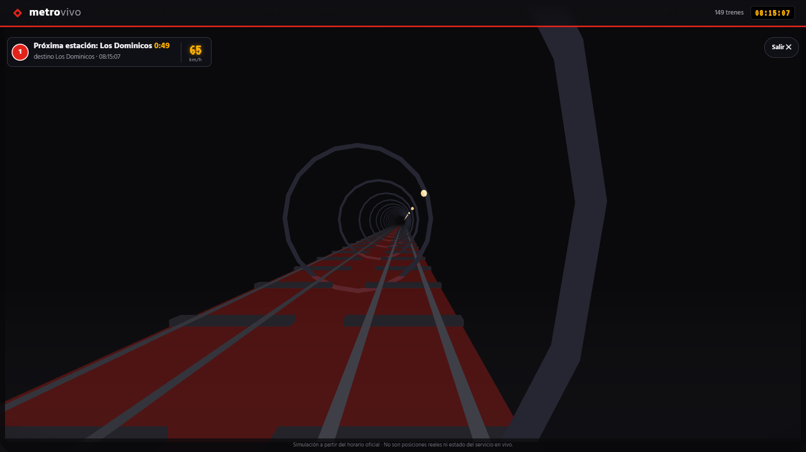
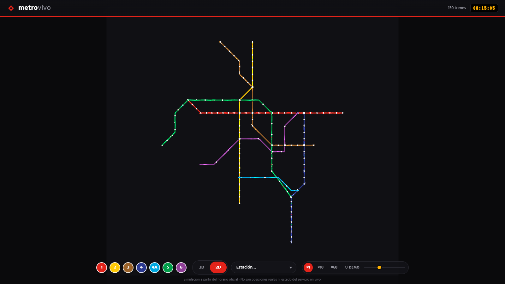
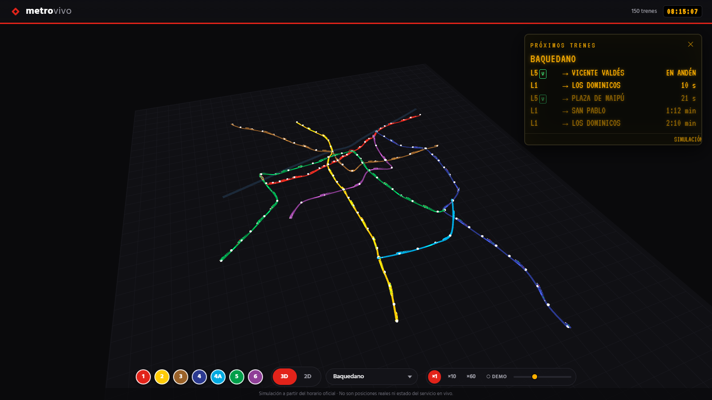
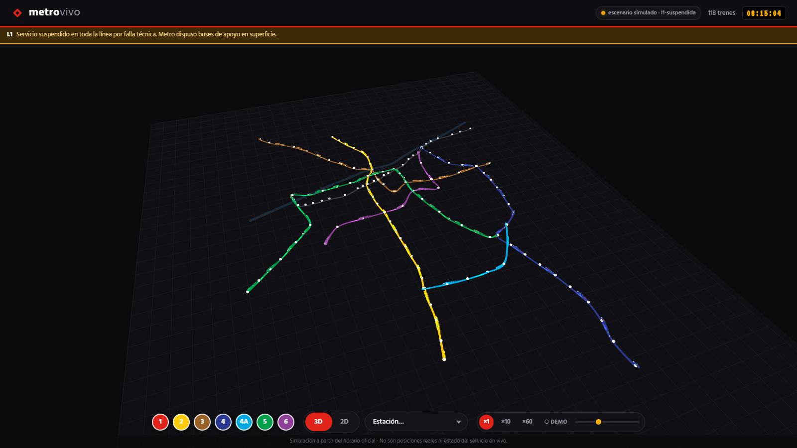
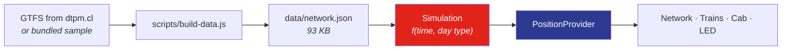

**English** · [Español](README.es.md)

<div align="center">



# metrovivo

**The Santiago de Chile Metro network in 3D and 2D — every train moving in sync with the official timetable.**

[](https://github.com/nsalloums/metrovivo-santiago/actions/workflows/deploy.yml)
[](LICENSE)
[](https://threejs.org)
[](https://nsalloums.github.io/metrovivo-santiago/)

### [→ Open the live demo](https://nsalloums.github.io/metrovivo-santiago/)

</div>

---

Seven lines, 126 stations, ~150 trains at morning rush hour. Every train's position
is a **deterministic function of the current time in `America/Santiago`** — derived
from published headways and a physical speed profile, not from random animation.
Click any train and the camera flies into its cab.

No map tiles, no external services, no backend. One three.js renderer draws the
whole thing.

> [!NOTE]
> **These are simulated positions, not real ones.** Metro de Santiago does not
> publish live vehicle positions, so metrovivo computes where each train *should*
> be according to the timetable. See [Why there is no live data](#why-there-is-no-live-data)
> — it's the most interesting constraint in the project.

## Quick start

```bash
npm install
npm run dev
```

Then open the URL Vite prints. That's it — no API keys, no `.env`, no services to run.

```bash
npm test     # 54 unit tests (Vitest)
npm run build
npm run smoke # 17 headless checks against the real build (Playwright)
```

## What you can do

| | |
|---|---|
|  | **Ride in the cab.** Click a train and the camera docks to its front window. The tunnel is generated procedurally — rings, wall lights and sleepers stream past at a rate matched to the simulated speed. The HUD shows the next station, a live countdown and the speed from the physical profile. |
|  | **Morph geography into the official diagram.** Every station stores two positions — its real coordinates and a schematic one at 0/45/90°. The switch is a vertex-to-vertex lerp, so stations never slide. |
|  | **Read the platform display.** An amber dot-matrix panel lists the next arrivals for any station, derived from the same departure schedule that drives the trains — so it always agrees with what you see on screen. |
|  | **Break the network on purpose.** `?estado=l1-suspendida` suspends a line: no new departures, trains already en route brake at their next station, and the line goes grey. Other scenarios close a station or a whole segment. |

Debug parameters: `?t=08:30` pins the clock, `?day=wd\|sa\|su` forces the day type,
`?estado=<scenario>` injects a contingency. Press <kbd>D</kbd> (or triple-tap) for the
debug overlay.

## How it works



`Simulation` is a pure function — no DOM, no renderer — which is why the whole engine
is unit-testable. `PositionProvider` is the seam: everything downstream consumes that
contract and doesn't know where positions come from.

<details>
<summary><b>The physics: why trains accelerate instead of easing</b></summary>

<br>

Each inter-station run uses a **trapezoidal speed profile** — accelerate at ~1 m/s²,
cruise, brake — solved in closed form so the train covers exactly *D* metres in the
*T* seconds the timetable allows. Cruise speed is clamped to 80 km/h; if the clamp
engages, acceleration is recomputed so the train still arrives on time.

The earlier implementation used sinusoidal easing, which never *sustains* a speed —
it peaks and immediately brakes. Real metros hold cruise for most of a run:

| L1 segment | Length | Time | Average | Sinusoidal peak | Trapezoidal cruise |
|---|---|---|---|---|---|
| República → Los Héroes | 355 m | 45 s | 28.4 km/h | 42.6 km/h | 36.7 km/h |
| Baquedano → Salvador | 931 m | 67 s | 50.0 km/h | 75.0 km/h | 70.9 km/h sustained |
| Escuela Militar → Manquehue | 1385 m | 100 s | 50.0 km/h | 75.0 km/h | 60.1 km/h sustained |

The average doesn't change — the timetable fixes it. The *shape* does, and that's
what you feel in the cab.

**1 unit = 1 metre** throughout. The local projection was audited against the
haversine distance: 0.05 % error over San Pablo↔Los Dominicos (16 177 m vs 16 185 m).
Run `node scripts/audit-units.mjs` to reproduce.

</details>

<details>
<summary><b>Rendering: one renderer, two cameras, zero tiles</b></summary>

<br>

- Each line is a triangle strip extruded along a centripetal Catmull-Rom curve through
  its stations, projected onto a local plane in metres centred on Santiago. Stations
  and trains are `InstancedMesh` — one draw call each.
- **3D**: perspective camera with damped orbit controls, tilted like a scale model.
- **2D**: orthographic top-down with pan/zoom.
- **The switch** is a ~1.2 s GSAP timeline that raises and levels the camera while
  narrowing the FOV, keeping the visible height constant — a dolly-zoom. The
  perspective projection converges on the orthographic one, so swapping cameras at
  the end is imperceptible.
- The city context (Mapocho river, street grid) is generated geometry, not imagery.
- The procedural tunnel exists **only** in cab view: rings and wall lights are pooled
  and repositioned in a moving window around the camera.

60 fps on mobile: static network geometry (the buffer is only rewritten during the
morph), `pixelRatio` capped at 2, unlit materials, no post-processing, and an
allocation-free render loop.

</details>

<details>
<summary><b>The geography ↔ diagram morph</b></summary>

<br>

Every station carries two positions: geographic (from GTFS or the bundled dataset)
and schematic (0/45/90° angles, uniform spacing, defined by hand in
`scripts/sample-data.mjs` with *pins* — stations anchored to the grid — and *vias* —
bends in the route). Stations without a pin are distributed uniformly between pins by
arc length.

The preprocessor samples **both** paths with the same parameterisation (16 samples per
inter-station segment), so the morph is a vertex-to-vertex lerp that never slides
stations. Trains are re-sampled every frame along both paths by arc length and blended
with the same progress, synchronised with the camera.

</details>

<details>
<summary><b>Express operation: Ruta Roja and Ruta Verde</b></summary>

<br>

On L2, L4 and L5, weekdays during peak hours (06:00–09:00 and 18:00–21:00), trains
alternate between two stopping patterns. Each pattern serves only its own stations
plus the shared ones, and crosses the rest at cruise speed without braking — the
trapezoidal profile is computed between *stops of the pattern*, not between stations.

| Line | Stations | Common trip | Ruta Roja | Ruta Verde |
|---|---|---|---|---|
| L2 | 26 | 34.9 min | 31.9 min (17 stops) | 31.9 min (17 stops) |
| L4 | 23 | 35.5 min | 32.8 min (15 stops) | 32.8 min (15 stops) |
| L5 | 30 | 42.7 min | 39.6 min (21 stops) | 39.9 min (22 stops) |

Trains already running when the window closes complete their pattern.

> [!WARNING]
> **The station classification is a manual approximation.** If the GTFS feed contains
> stopping variants, the preprocessor derives them automatically — but DTPM's feed does
> not model Roja/Verde, so the classification lives in `express-config.json` as a
> hand-written approximation to the scheme known as of January 2026. These change over
> the years. Verify against [metro.cl](https://www.metro.cl) before relying on them.

</details>

<details>
<summary><b>Timetable and fleet</b></summary>

<br>

Service runs 06:00–23:00 on weekdays and Saturdays, 07:30–23:00 on Sundays; outside
those hours the app shows a "Metro cerrado" screen. Virtual trains depart each terminal
according to the headway in force and dwell ~20 s per platform.

| Line | Stations | Peak headway | Off-peak | Trains @ 08:00 | Round trip |
|---|---|---|---|---|---|
| L1 | 27 | 120 s | 210 s | 32 | 31.9 min |
| L2 | 26 | 160 s | 260 s | 24 | 34.9 min |
| L3 | 21 | 180 s | 300 s | 22 | 32.4 min |
| L4 | 23 | 180 s | 300 s | 22 | 35.5 min |
| L4A | 6 | 300 s | 480 s | 6 | 11.7 min |
| L5 | 30 | 150 s | 240 s | 32 | 42.7 min |
| L6 | 10 | 240 s | 360 s | 10 | 20.3 min |

Fleet across the network: **148 trains at 08:00**, 96 at midday, 60 at 22:00.

</details>

<details>
<summary><b>Making motion perceptible</b></summary>

<br>

At real speed a train doing 50 km/h across a 30 km city is nearly imperceptible.
That's scale, not a bug. To make the network feel alive:

- **Trails** — each train drags additive quads in its line colour, fading with
  distance and extinguishing when it stops.
- **Breathing** — trains pulse subtly while dwelling at a platform.
- **Time controls** — ×1 / ×10 / ×60, a time-of-day slider, and a "● VIVO" button
  that returns to real Santiago time. At ×60 the whole network circulates visibly.

All of it respects `prefers-reduced-motion`: no trails, no pulse, shortened camera
tweens, static LED marquee.

</details>

<details>
<summary><b>Design decisions</b></summary>

<br>

- **Line colours** approximated by eye against the official map: L1 `#E2231A`,
  L2 `#FFCB05`, L3 `#9A6229`, L4 `#2B3990`, L4A `#00A9E0`, L5 `#009E49`, L6 `#8F3F97`.
- **Typography** from transit signage: [Hind](https://fonts.google.com/specimen/Hind)
  (humanist sans, Frutiger-like) plus VT323 for the LED panel, with system fallbacks.
- **Line badges** — coloured circle, white number, as on real signage; they double as
  clickable filters.
- **Station tooltip** = platform nameplate: name plus interchange badges, bordered in
  the primary line's colour.
- **Own logo mark.** Metro's official logo is a registered trademark and is not used;
  the red diamond is original.

</details>

## Why there is no live data

An earlier version claimed to show the **real** service status — suspended lines,
closed stations — fetched through a serverless proxy. That feature has been removed,
and the reason is worth writing down.

Two sources exist. Neither works from a static site:

| Source | Status | Why it fails |
|---|---|---|
| `metro.cl/api/estadoRedDetalle.php` | **Live and accurate** | Sends no CORS headers. A browser cannot read it; it needs a server-side proxy. |
| `api.xor.cl/red/metro-network` | **Silently broken** | Sends `access-control-allow-origin: *`, but it scrapes `metro.cl/tu-viaje/estado-red` — a page that now returns **404**. It answers `{"issues": false, "lines": []}` forever. |

The second one is the dangerous one. It returns HTTP 200, valid JSON and
`api_status: "OK"` while reporting an empty network. Checked against reality on
2026-07-30: metro.cl reported L5 with *"Santa Isabel estará cerrada y sin detención de
trenes"*; the community API reported no issues at all.

**A silently false "everything is normal" is worse than no data**, especially for
someone deciding whether to take the metro. So the live layer is gone rather than
wrong.

What survived is the part that was actually interesting — the **contingency engine**.
The scenarios in [`src/scenarios.js`](src/scenarios.js) are injected with
`?estado=<name>` and the simulation genuinely reacts: suspended lines stop dispatching
and running trains brake at their next station; a closed segment splits the line into
sub-lines that turn back at the boundaries; a single closed station gets crossed at
cruise speed, reusing the express pass-through physics.

**Re-enabling live status** needs exactly one thing: a server-side proxy for metro.cl
(any runtime works) and a normaliser for its actual schema, which is
`{"l1": {estado, mensaje_app, estaciones: [...]}, ...}` — an object keyed by line, not
the `{lineas: [...]}` array shape the old parser expected. `Simulation.applyEstado()`
already accepts the normalised form, so nothing else would change.

## Data

`scripts/build-data.js` generates `data/network.json` (93 KB): sampled line curves,
both positions per station, and headways by time band and day type.

- **With official GTFS** — download the current feed from
  [dtpm.cl](https://www.dtpm.cl/index.php/documentos/gtfs-vigente), unzip it and run
  `node scripts/build-data.js path/to/gtfs`. The script filters `route_type = 1`, takes
  the representative trip per route, derives headways from `frequencies.txt` +
  `calendar.txt` and maps the schematic layout by station name.
- **Without GTFS** — a bundled sample dataset is used: the 7 real lines (L1–L6 and L4A,
  126 stations) with approximate coordinates (±300 m) and headways within published
  ranges. This is what the live demo runs on, and it has not yet been validated against
  a production GTFS feed.

## Deployment

Every push to `main` publishes to GitHub Pages via
[`.github/workflows/deploy.yml`](.github/workflows/deploy.yml) — tests run first, then
the build, then the deploy. The only setup is **Settings → Pages → Source: GitHub
Actions**. The base path is derived from the repository name automatically, so a fork
deploys to its own URL with no edits.

## Contributing

Issues and pull requests are welcome. Run `npm test` and `npm run smoke` before opening
one. The most useful contributions right now: validating the build against a production
GTFS feed, and verifying the Ruta Roja/Verde classification in `express-config.json`
against current metro.cl information.

## License

Code is [MIT](LICENSE). Trademarks, data provenance and attribution are covered in
[NOTICE.md](NOTICE.md).

metrovivo is not affiliated with Metro de Santiago or DTPM. "Metro" and its logo are
trademarks of their respective owners; this project uses an original logo mark and
approximated signage colours. Train positions are simulated and must not be used to
plan a trip.
